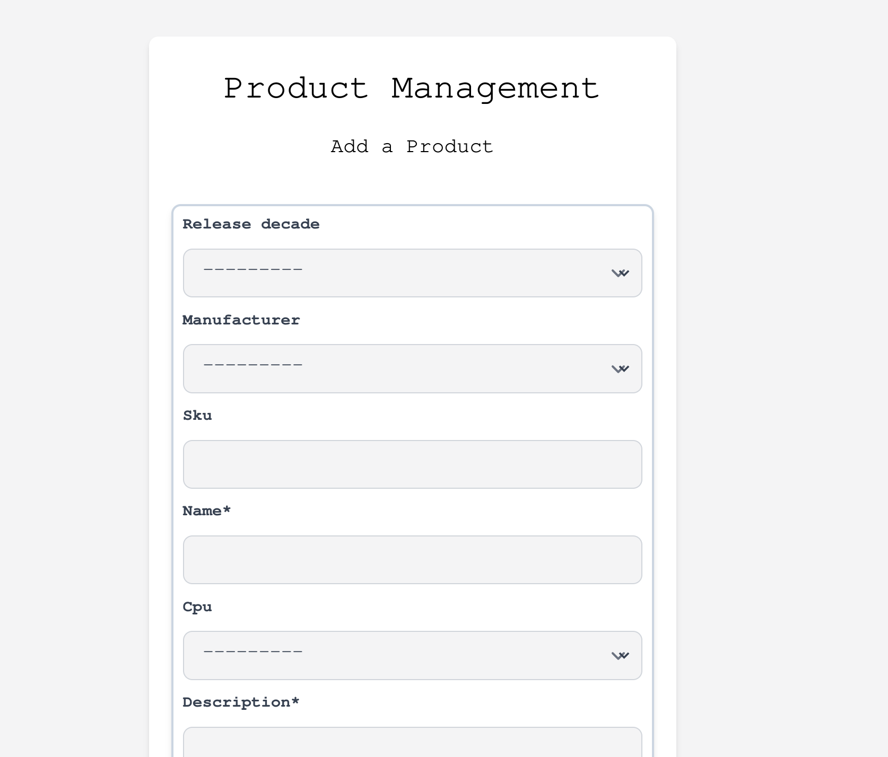
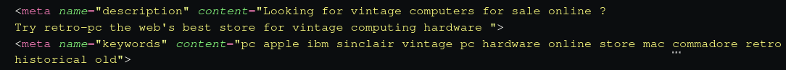

## RetroPc E-Commerce Website

A fictional ecommerce website for the selling of vintage PC hardware. 

The site has been developed using Django, features Stripe integration and has been deployed to Heroku.


## Table of Contents

- [Objectives](#objectives)
- [Development](#development)
- [Design](#design)
- [Database Model & Schema](#database-model---schema)
- [Features](#features)
- [Testing](#testing)
- [Marketing](#marketing)
- [SEO](#seo)
- [Deployment](#deployment)
- [Technologies Used](#technologies-used)
- [Credits](#credits)


## Objectives

The objective of the project was to build a fully functioning ecommerce website with a responsive design and Stripe integration. The site is styled as an online marketplace selling vitage computer hardware.


## Development

An agile approach was used in the Developmet of the site. Development of the site was broken down into four distinct sprints as follows:

- 01 - Initial Deployment
- 02 - Development of Core Functionality
- 03 - Site styling & enhancements
- 04 - Testing & Documentation

The Sprints were tracked on Github using the Github [milestone](https://github.com/eoinlarkin/retro-pc/milestones?state=closed) tracker.

### User Stories

In designing the site, I defined a number of user stories as follows. User stories were recorded and tracked in the [Project Kanban Board](https://github.com/users/eoinlarkin/projects/2).

User stories were categorised as either _"must have"_  or _"nice to have"_. Not all user stories categorised as _"nice to have"_ were implemented. These have been left open as issues on the [GitHub issues](https://github.com/eoinlarkin/retro-pc/issues) page.

The user stories classified as _**"must_have"**_ for the site were defined as follows:

#### Viewing and Navigating

- As a **shopper** I would like to **view a list of products**
- As a **shopper** I would like to **view individual product details**

#### Registration and User Accounts

- As a **site user** I would like to **easily register for an account**
- As a **site user** I would like to **easily login / logout**
- As a **site user** I would like to **easily recover my password**
- As a **site user** I would like to **have a personalised order history**

#### Sorting and Searching

- As a **shopper** I would like to **select the product category**
- As a **shopper** I would like to **search for a product by name or description**
- As a **shopper** I would like to **search for products from any page**
- As a **shopper** I would like to **see what I've searched for**

#### Purchasing and Checkout

- As a **shopper** I would like to **select the quantity of product when purchasing**
- As a **site owner** I would like to **offer an easy to use payment method**

#### Backend Features

- As a **site owner** I would like to **redirect users to an informative 404 page for bad links**
- As a **site owner** I would like to **easily add, remove and modify products**
- As a **site owner** I would like to **give users the ability to sign up to a newsletter**

User stories classified as _**nice to have**_ which were uncompleted were marked as open on the Github issues page.

## Design

The site was developed using Tailwind CSS and targets a responsive design that will work across different sized screens and devices.

### Wireframes

Wireframes were created in advance of the design of the layout of the site. As the development of the site progressed, the design evovled however the original wireframes largely reflect the final site design:

<details>
  <summary><strong style="color:skyblue">Footer</strong></summary>
  
  </details>  

<details>
  <summary><strong style="color:skyblue">Navigation Bar</strong></summary>
  
  </details>  

<details>
  <summary><strong style="color:skyblue">Landing Page</strong></summary>
  
  </details>  

<details>
  <summary><strong style="color:skyblue">Cart Summary</strong></summary>
  
  </details>  

<details>
  <summary><strong style="color:skyblue">Checkout</strong></summary>
  
  </details>  

<details>
  <summary><strong style="color:skyblue">Sign-Up / Register</strong></summary>
  
  </details>  


### Color Palette

A broad color palette was chosen for the site with a range of complimenting colors chosen. In choosing the color palette, my objective was to select a color palette that would create a strong visual identity with a number of colors with high contrast.


In defining the colors in the HTML code, custom [Tailwind color codes](https://tailwindcss.com/docs/customizing-colors) were defined; the hex codes corresponding to the custom codes were as follows:

| Color          |Hex Code        |
|----------------|----------------|
|      Yellow    |`#D97706`       |
|      Blue      |`#235789`       |
|      Black     |`#000000`       |
|      White     |`#F4F4F5`       |
|      Red       |`#9B1D20`       |
|      Green     |`#3F8D48`       |
|      Pure-white|`#FFF`          |
|      Gray      |`#CBD5E1`       |

### Fonts

In choosing the font for the site, I elected to use a `monospace` font; this was in keeping with the theme of the site and helped to add to the identity of the site.

## Database Model & Schema

In building the application, the following applications and associated models were created:

**store**

- ReleaseDecade
- Manfacturer
- CPU
- Product

**cart**

- Order
- OrderLineItem

**user_account**

- UserProfile
- NewsletterSubscribers

The application features four custome models; _Manufacturer_, _CPU_, _Product_ and _NewsletterSubscribers_. These are used to store information relating to the products as well as for the storing of users signed up to the site newsletter.

The following diagram provides an overview of the various models used by the application and the relationship between them.


## Features

### Implemented Features

- <details>
  <summary><strong style="color:skyblue">Toast Functionality:</strong></summary>
  
  </details>

- <details>
  <summary><strong style="color:skyblue">Newsletter Signup:</strong></summary>
  
  </details>

- <details>
  <summary><strong style="color:skyblue">Product Management Page:</strong></summary>
  
  </details>

- <details>
  <summary><strong style="color:skyblue">Stripe Integration:</strong></summary>
  
  </details>

- <details>
  <summary><strong style="color:skyblue">Custom 404 Page:</strong></summary>
  
  </details>


### Future Additional Features

Future additional features for the site are as follows:

- As a shopper I would like to sort multiple categories simultaneously 
- As a shopper I would like to sort the list of products
- As a site user I would like to recieve a confirmation after registering 
- As a shopper I would like to easily view the total of my purchases at any time

These user stories have been recorded in the [issues](https://github.com/eoinlarkin/retro-pc/issues) section of GitHub and marked for future development.

## Testing

Testing of the site is documented in the [TESTING.md](TESTING.md) file

## Marketing

### Business Model

retro-pc is a business to customer (B2C) website focusing on selling rate and vitage computer equipment. The website does business directly with customers. Key site features are the ability to search the site, complete an order and process payments through approved payment providers.

### Facebook Business

A mockup of a Facebook business page has been created for the retro-pc webiste. As this was A real Facebook marketing site could be used to advertise the business, promote the products sold on the website and communicate directly with customers.

<details>
  <summary><strong style="color:skyblue">Facebook Marketing Page:</strong></summary>
  
  </details>

### Newsletter Signup

A newsletter signup form was implemented via a Django form. This allows users to enroll in the site newsletter. Details of users signed up to the newsletter can be accessed in the administration backend.

On signing up to the newsletter, a toast is posted confirming the subscription. If a user already is a subscriber; they receive a toast confirming that they have already subscribed to the newsletter and no new data is posted to the database.

In addition to capturing the user's email, the date that the user subscribed to the newsletter is also recorded.

<details>
  <summary><strong style="color:skyblue">Newsletter Form:</strong></summary>
  
  </details>

<details>
  <summary><strong style="color:skyblue">Newsletter Admin Panel:</strong></summary>
  
  </details>  

<details>
  <summary><strong style="color:skyblue">Newsletter Subscriber Detail:</strong></summary>
  
  </details>  

## SEO

### META Tags

Descriptive meta tags were added to the site headers to optimise the site for SEO purposes.

- <details>
  <summary><strong style="color:skyblue">Meta Tag:</strong></summary>
  
  </details>  

### sitemap.xml

A sitemap was made to list the websites important URL's to ensure that search engines are able to easily index the site. This xml was generated using [XML-sitemaps.com](XML-sitemaps.com)

### robots.txt

A robots.txt file was created to supprt the indexing of the site by search engines. A robots.txt file was created with the follwoing content:

```
User-agent: *
Disallow:
Sitemap: YOUR_SITEMAP_URL
```

## Deployment

### Local CLone

In order to make a local clone, the recommended approach is to use the command line interface. The following steps should be taken :

- Navigate to the repository [website](https://github.com/eoinlarkin/retro-pc)
- By clicking on the `Code` button, it is possible to copy the HTTPS link for the repository
- Open the commandline interace on the local computer and navigate to the working directory into which you wish to clone the repository.
- Open commandline interface on your computer
- Enter the following command:  
  `git clone https://github.com/eoinlarkin/retro-pc.git`
- Press Enter. Your local clone will be created.

### Heroku Deployment

Heroku was chosen as the hosting platform for the application. In addition Cloudinary was used as the hosting platform for media and static files.

In order to deploy the application to Heroku, the following steps should be followed:

- Create a `requirements.txt file: pip freeze > requirements.txt`

- Define a Procfile with the following content for use by Heroku; this should sit in the the root directory: 
`web: gunicorn retropc.wsgi:application`

- Create a new application in Heroku.

- Add the following Heroku Resources:
  - Heroku Postgres  

- Define the following Environmental Variables in Heroku:

  |Key           | Value                         |
  |---------------|-------------------------------|
  |DATABASE_URL   |Heroku postgres database URL   |
  |SECRET_KEY     | application secret key        |
  |CLOUDINARY_URL     | unique cloudinary url        |
  |DEBUG_MODE | should be set equal to False for deployment |
  | EMAIL_HOST_PASS | password for email provider|
  | EMAIL_HOST_USER | user name for email provider |
  | SECRET_KEY | Django secret key for application |
  | STRIPE_PUBLIC_KEY | Stripe public key |
  | STRIPE_SECRET_KEY | Stripe secret key |
  | STRIPE_WH_SECRET | Stripe webhook key | 


- Create the database schema locally by running the following Django commands:

```
python manage.py makemigrations  
python manage.py migrate
```

- Create a superuser for the application: `python manage.py createsuperuser`

- Add the hostname of Heroku app to allowed ALLOWED_HOSTS in settings.py: `ALLOWED_HOSTS = ['Heroku app URL', 'localhost]`

- Push the code to GitHub

- Ensure the Heroku CLI is installed and authenticated. Link the local repository to the Heroku Application with the following command:  
`heroku create -a APP_NAME`

- Push the code to Heroku with the following command: `git push heroku`

## Technologies Used

### Languages

- Python
- Jinga 
- Javascript

### Tools

- [VScode](https://code.visualstudio.com/)  
  All coding was completed in VS Code.
- [Heroku](https://www.heroku.com/)  
  Heroku was used for the deployment of the app.
- [Black](<https://github.com/psf/black>)  
  Black was used as the Linter for Python files.
- [Stripe](www.stripe.com)  
  Stripe was used as the payments platform.
- [Django](https://www.djangoproject.com/)  
  The Django framework was used to develop the site.
- [TailwindCSS](https://tailwindcss.com/)  
  TailwindCSS was used as teh CSS framework to accelerate development of the site.
- [coolors.co](https://coolors.co/)  
  Potential site palettes were tested with Coolors.
- [Figma](https://www.figma.com/templates/wireframe-kits/)  
  Wireframes for the site were generated using Figma
- [gauger.io](gauger.io)  
  This website was used to generate the favicon using an icon from Font Awesome.
- [Markdown TOC](https://ecotrust-canada.github.io/markdown-toc/)  
  For generating the formatted table of contents in markdown

## Credits

In developing the site, the following code / tools / content was leveraged:

### Code

The following code was levraged in order to develop the site. In addition site logic was based on template logic from the [Code Institute Boutique Ado](https://github.com/Code-Institute-Solutions/boutique_ado_v1) repository. 

- **[Sticky Footer](https://stackoverflow.com/questions/59812003/tailwindcss-fixed-sticky-footer-on-the-bottom)**  

- **[CSS Not Rendering Locally](https://stackoverflow.com/questions/35557129/css-not-loading-wrong-mime-type-django)**

- **[404 Error](https://www.vectorstock.com/royalty-free-vector/power-plug-and-cloud-icon-in-shape-on-a-white-vector-29024655">)**

- **[Custom Tailwind Fonts](https://blog.logrocket.com/how-to-use-custom-fonts-tailwind-css/)**

- **[Tailwind Dropdown Buttons](https://codepen.io/robstinson/pen/LYNJLxm)**

- **[Header with Hamburger Menu](https://codepen.io/Zeeslag/pen/MWpLoKX)**

### Content

  Content for the site including images and details on the various vintage computer hardware was sourced from [wikipedia.com](https://www.wikipedia.com)

### Images

- The cover icon is derived from an icon sourced from [iconfinder.com](iconfinder.com)
      [link](https://www.iconfinder.com/icons/5426888/apple_mac_pc_retro_icon)

### Other

- `venv` was used to manage the python dependencies.
- [Cloudinary](https://cloudinary.com/) was used for the upload and storage of both media and static files.
- [Heroku](https://heroku.com) was used for the deploymnet of the site.
