# Testing

Testing was completed on the site to ensure it functioned as intended; in addiiton testing was completed on the underlying code to ensure they met relevant compliance standards as well as validating the overall peformance of the was acceptable.

Details of testing is as follows:

* [Functionality](#functionality)
* [Non Functional Tests](#non-functional-tests)
* [Validators](#validators)
* [Performance](#performance)

## Functionality

In order to validate the functionality of the website, Functional and Non-Functional testing was completed. Testing was completed using a manual test approach.

### Navigation Bar

 * [X] All Navbar links open the correct webpages
 * [X] Navbar links that are not relevant to guest users are not rendered (e.g. Upload Link)
 * [X] Hover and focus styles work correctly
 * [X] The hamburger menu works correctly and renders on smaller device sizes

### Footer

 * [X] All footer links open in new windows
 * [X] All footer links resolve to valid webpages
 * [X] Hover and focus styles work correctly
 * [X] Details of the current logged in user are displayed correctly

### Toasts
* [X] Toasts display correctly
* [X] Toasts can be dismissed

### Register Page

* [X] Creating a new user works correctly
* [X] Hover and focus styles work correctly
* [X] The Cover Image renders correctly and scales to various device sizes
* [X] Deleting a user also removes their uploaded activities

### Sign-in Page

* [X] The Sign In page renders correctly
* [X] The Sign In form features defensive validation; it is not possible to sign in unless all fields are populated
* [X] The Cover Image renders correctly and scales to various device sizes
* [X] Hover and focus styles work correctly
* [X] The link to the register page renders correctly

### Sign Out Page

* [X] The Sign Out page renders correctly
* [X] The Sign Out button successfully logs out a user
* [X] The Cancel button returns the user to the home page
* [X] The Cover Image renders correctly and scales to various device sizes
* [X] Hover and focus styles work correctly

### Store Page

* [X] The store page renders correctly
* [X] The filters on the store page work correctly
* [X] The size is responsive for different device sizes
* [X] The search fucntionality works correctly

### Order Summary Page

### Edit Store Item Page

* [X] The store page renders correctly
* [X] The filters on the store page work correctly

### Checkout Page

* [X] The store page renders correctly
* [X] The filters on the store page work correctly

## Non Functional Tests

* [X] Email service functioning correctly
* [X] Debug mode has been deactivated
* [X] Site newsletter signup works correctly

## Validators

### HTML

The W3 HTML validator was used to validate the HTML code of the site. The results were as follows:

- 

  
<strong style="color:skyblue">Homepage:</strong>

  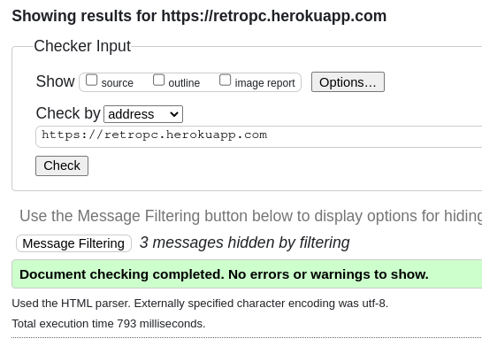

  

- 

  
<strong style="color:skyblue">Login:</strong>

  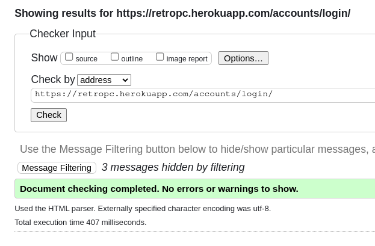

  

- 

  
<strong style="color:skyblue">Password Reset:</strong>

  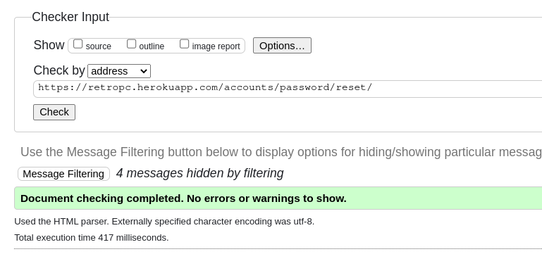

  

- 

  
<strong style="color:skyblue">Modify Activities:</strong>

  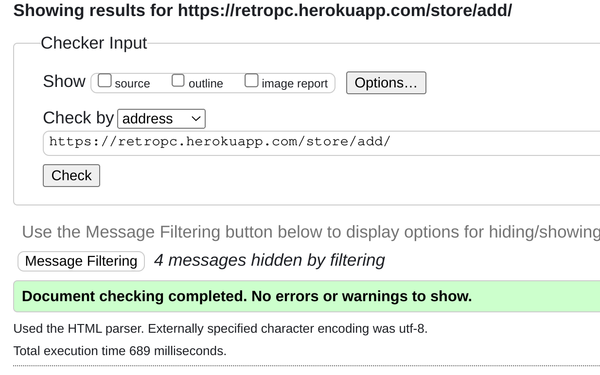

  

- 

  
<strong style="color:skyblue">Checkout:</strong>

  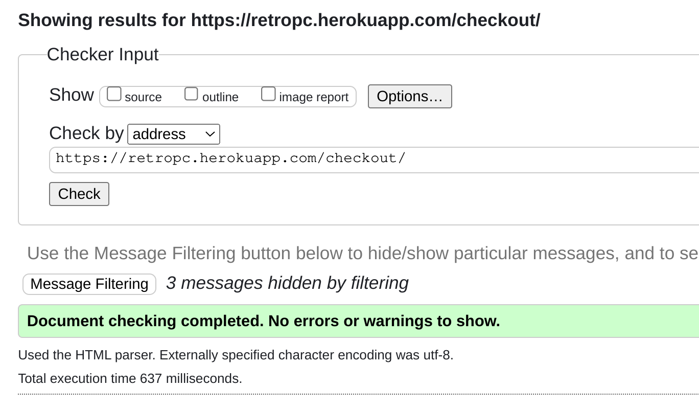

  

- 

  
<strong style="color:skyblue">Cart:</strong>

  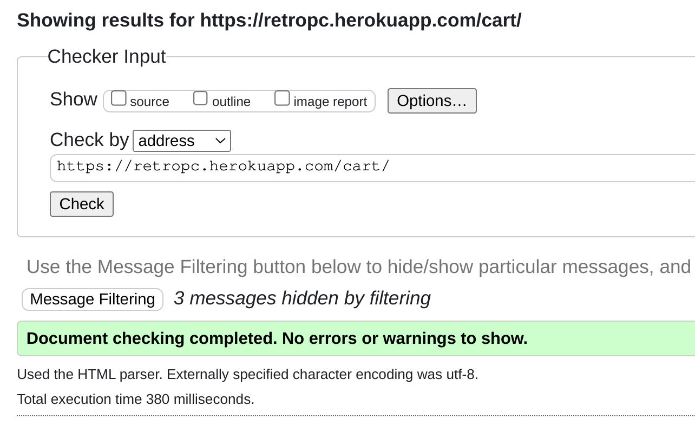

  

- 

  
<strong style="color:skyblue">Store:</strong>

  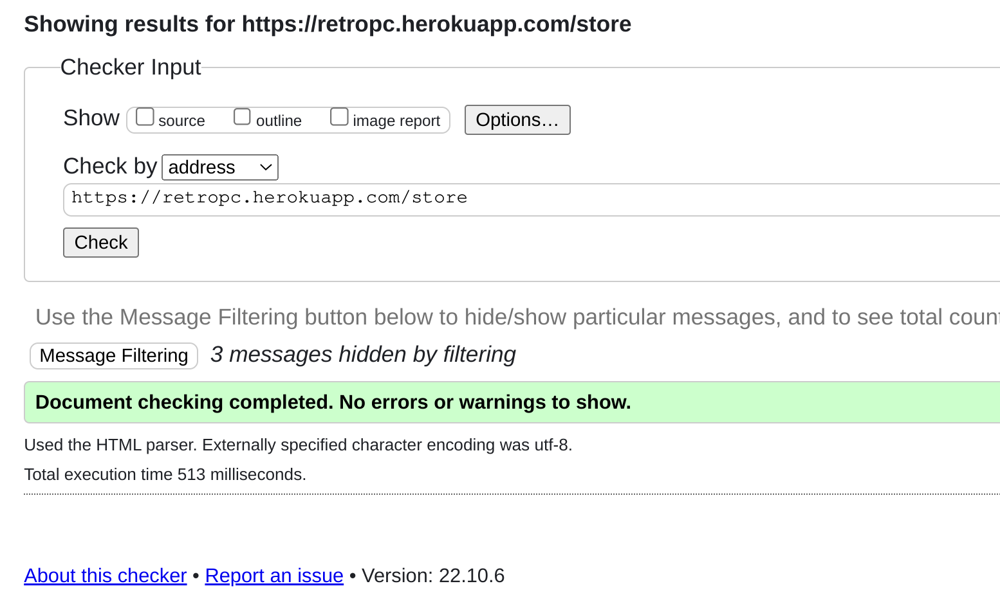

  

### Python

PEP8 compliance was managed directly in VS Code using the [black](https://github.com/psf/black) linter. Prior to final deployment the files were also tested using the [PEP8 Online Validator](http://pep8online.com/)

The following `.py` files were tested using the linter:

**cart App**
* :heavy_check_mark: **admin.py**
* :heavy_check_mark: **apps.py**
* :heavy_check_mark: **contexts.py**
* :heavy_check_mark: **models.py**
* :heavy_check_mark: **tests.py**
* :heavy_check_mark: **urls.py**
* :heavy_check_mark: **views.py**

**checkout App**
* :heavy_check_mark: **admin.py**
* :heavy_check_mark: **apps.py**
* :heavy_check_mark: **forms.py**
* :heavy_check_mark: **models.py**
* :heavy_check_mark: **signals.py**
* :heavy_check_mark: **tests.py**
* :heavy_check_mark: **urls.py**
* :heavy_check_mark: **views.py**
* :heavy_check_mark: **web_handler.py**
* :heavy_check_mark: **webhooks.py**

**store App**
* :heavy_check_mark: **admin.py**
* :heavy_check_mark: **apps.py**
* :heavy_check_mark: **contexts.py**
* :heavy_check_mark: **forms.py**
* :heavy_check_mark: **models.py**
* :heavy_check_mark: **tests.py**
* :heavy_check_mark: **urls.py**
* :heavy_check_mark: **views.py**

**retropc App**
* :heavy_check_mark: **asgi.py**
* :heavy_check_mark: **settings.py**
* :heavy_check_mark: **urls.py**
* :heavy_check_mark: **views.py**
* :heavy_check_mark: **wsgi.py**

### Javascript

Javascript files were tested for compatability with recommended javascript formatting using [jshint.com](jshint.com). No issues were noted in the files aside from some minor warnings:

- 

  
<strong style="color:skyblue">`drawer.js`:</strong>

  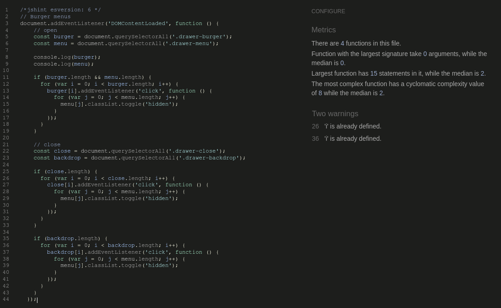

  

- 

  
<strong style="color:skyblue">`hamburger.js`:</strong>

  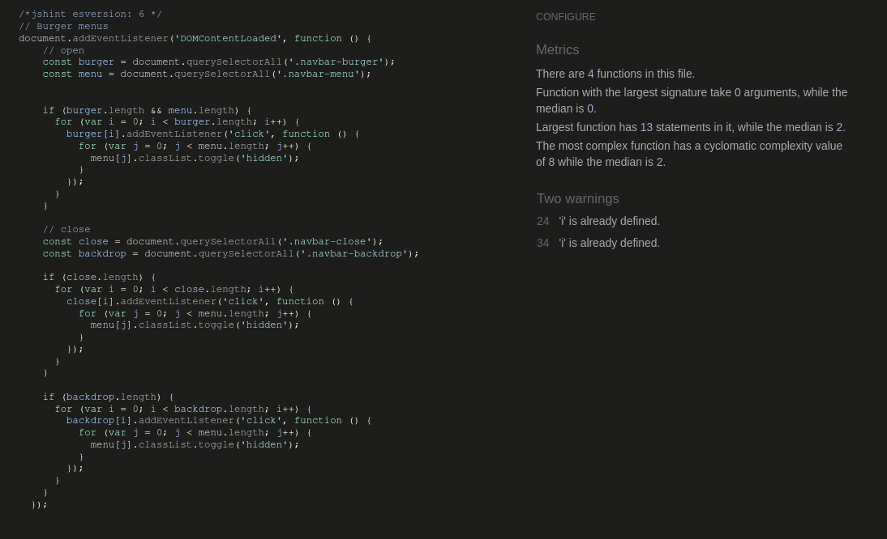

  

- 

  
<strong style="color:skyblue">`quantity_input_select.js`:</strong>

  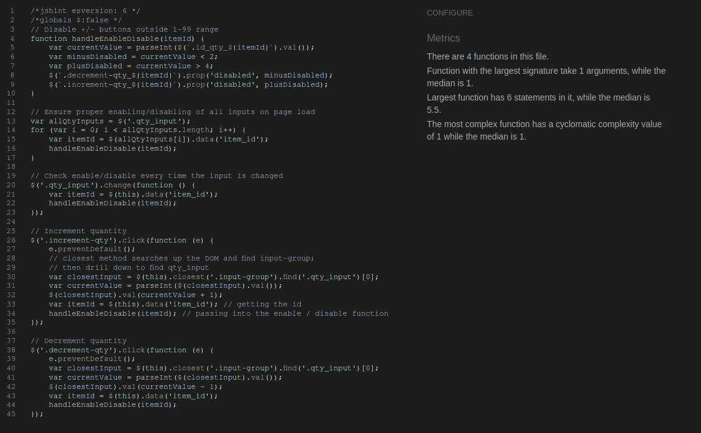

  

- 

  
<strong style="color:skyblue">`stripe_elements.js`:</strong>

  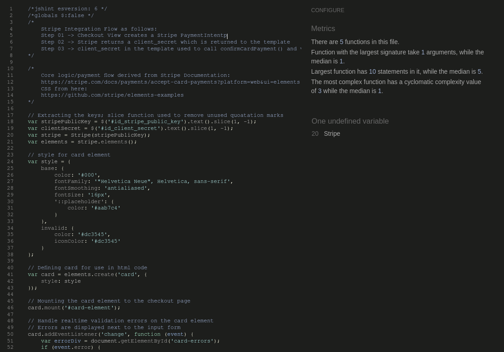

  

- 

  
<strong style="color:skyblue">`toast.js`:</strong>

  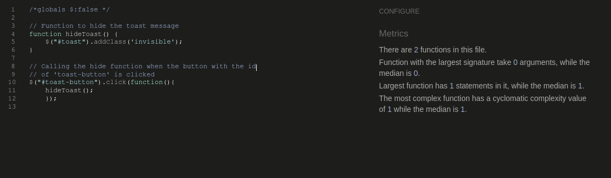

  

## Performance

Site performance was tested using the Ligthouse feature in Chrome. The results for the base homepage for mobile and desktop devices was as follows:

- 

  
<strong style="color:skyblue">Lighthouse Desktop:</strong>

  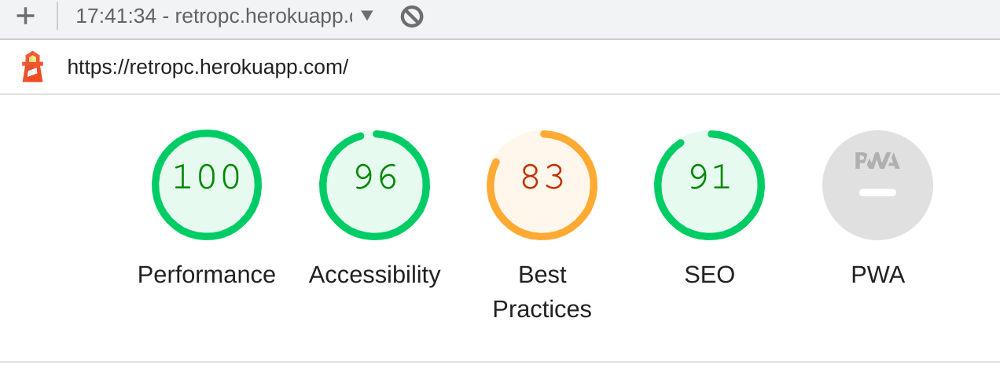

  

- 

  
<strong style="color:skyblue">Lighthouse Mobile:</strong>

  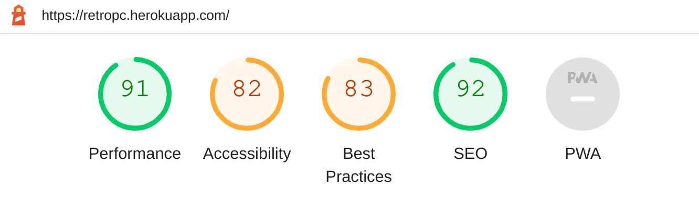

  

Overall performance was acceptable and no further changes to the site were deemed necessary.