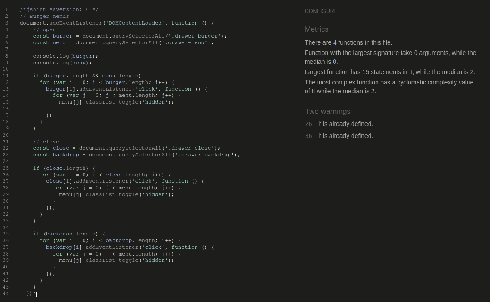

# Testing

## Non Functional Tests

- Is the email console backend disabled ?
- Is debug mode deactivated ?

## Functionality Tests

- Can a user without an account make an order
- If I delete a user account can I still view the order history ?
- Can I manually upload a product
- Can I purchase the uploaded product
- Do all messages render correctly on the site?

## Add Product Form

- Can add new product using form
- Check that the if an invalid field is submitted the form will return an error
  - Check that for numeric fields the number of digits corresponds to the database definition
- Form is only accessible if the user is a superuse
- Images can be added successfully through the form
- Products that have been added manually can be added to the cart
  - May need to include if statement logic if the image does not render correctly

## Stripe Webhooks

- These can be tested by checking Video # 055
- This can be tested by commenting out the form.submit() in the stripe_elements.js

## Validators

### HTML

The W3 HTML validator was used to validate the HTML code of the site. The results were as follows:

### Python

PEP8 compliance was managed directly in VS Code using the [black](https://github.com/psf/black) linter. Prior to final deployment the files were also tested using the [PEP8 Online Validator](http://pep8online.com/)

The following `.py` files were tested using the linter:

**cart App**
* :heavy_check_mark: **admin.py**
* :heavy_check_mark: **apps.py**
* :heavy_check_mark: **contexts.py**
* :heavy_check_mark: **models.py**
* :heavy_check_mark: **tests.py**
* :heavy_check_mark: **urls.py**
* :heavy_check_mark: **views.py**

**checkout App**
* :heavy_check_mark: **admin.py**
* :heavy_check_mark: **apps.py**
* :heavy_check_mark: **forms.py**
* :heavy_check_mark: **models.py**
* :heavy_check_mark: **signals.py**
* :heavy_check_mark: **tests.py**
* :heavy_check_mark: **urls.py**
* :heavy_check_mark: **views.py**
* :heavy_check_mark: **web_handler.py**
* :heavy_check_mark: **webhooks.py**

**store App**
* :heavy_check_mark: **admin.py**
* :heavy_check_mark: **apps.py**
* :heavy_check_mark: **contexts.py**
* :heavy_check_mark: **forms.py**
* :heavy_check_mark: **models.py**
* :heavy_check_mark: **tests.py**
* :heavy_check_mark: **urls.py**
* :heavy_check_mark: **views.py**

**retropc App**
* :heavy_check_mark: **asgi.py**
* :heavy_check_mark: **settings.py**
* :heavy_check_mark: **urls.py**
* :heavy_check_mark: **views.py**
* :heavy_check_mark: **wsgi.py**

### Javascript

Javascript files were tested for compatability with recommended javascript formatting using [jshint.com](jshint.com). No issues were noted in the files aside from some minor warnings:

  
<strong style="color:skyblue">`drawer.js`:</strong>

  

  

  
<strong style="color:skyblue">`hamburger.js`:</strong>

  

  

  
<strong style="color:skyblue">`quantity_input_select.js`:</strong>

  

  

  
<strong style="color:skyblue">`stripe_elements.js`:</strong>

  

  

  
<strong style="color:skyblue">`toast.js`:</strong>

  

  
